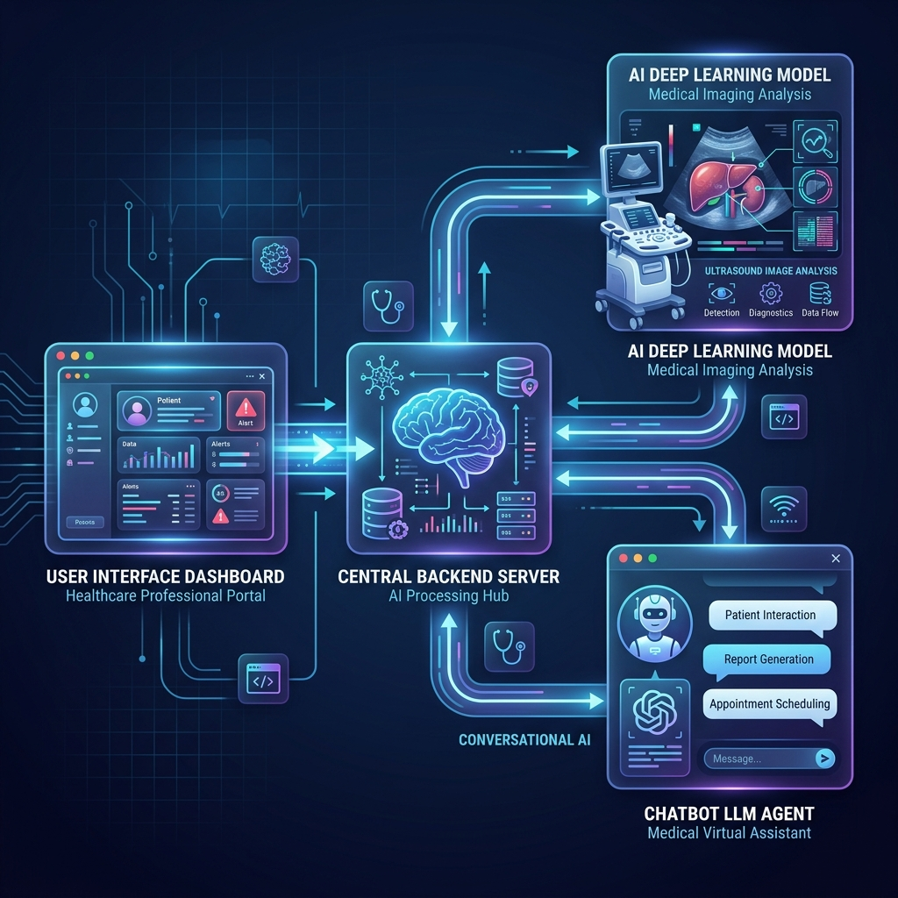
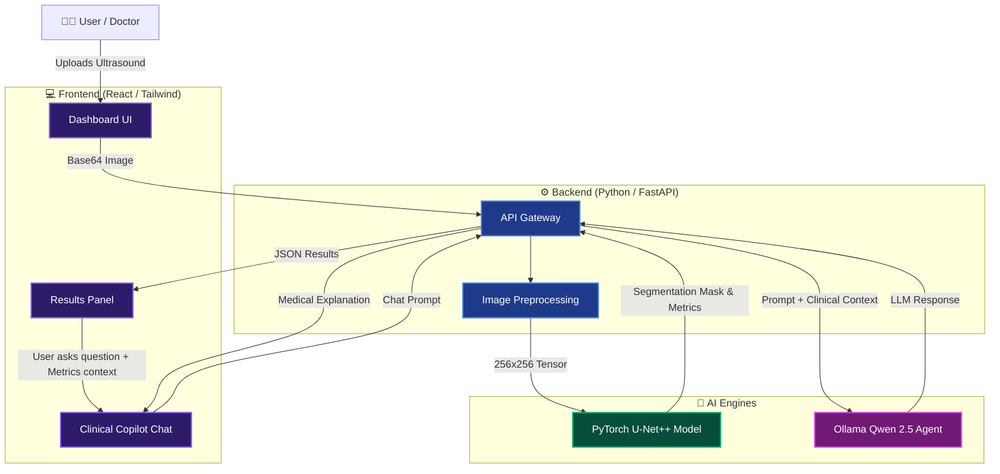

# 🧠 NeuroScan AI: Complete Project Explanation (Simple Guide)

This document breaks down the entire Fetal Brain Segmentation project into simple, easy-to-understand concepts. Use this to understand exactly how the project works from the inside out.

---

## 1. What is the Goal of this Project?
The goal is to provide **Clinical Decision Support**. When a doctor takes an ultrasound of a fetus's brain, it can be blurry and hard to read. We built an AI that acts like a highly trained radiologist. It looks at the ultrasound and instantly colors in the most important brain structures.

## 2. The Inputs & Outputs

### 📥 What goes IN (The Input)
- **A Single Image**: The user uploads a 2D fetal ultrasound image (PNG, JPG, etc.).
- **Preprocessing**: Before the AI sees it, our code shrinks the image to a standardized size (`256 x 256 pixels`) and converts it to pure grayscale. This removes unnecessary data and helps the AI process it faster.

### 📤 What comes OUT (The Output)
1. **The Segmentation Mask**: A black image where the AI has drawn colored blocks over where it thinks the structures are:
   - 🔴 **Red** = Brain (The main brain tissue)
   - 🟢 **Green** = CSP (Cavum Septum Pellucidum - a tiny fluid gap in the middle of the brain)
   - 🔵 **Blue** = LV (Lateral Ventricles - cavities filled with fluid)
2. **The Overlay**: The colored mask is made semi-transparent and placed *on top* of the original ultrasound. This lets the doctor verify if the AI colored the correct areas.
3. **The Confidence Heatmap**: A bright glowing image highlighting pixels where the AI is highly confident versus pixels where it is "guessing".
4. **The Metrics (JSON)**: Mathematical scores telling us exactly how certain the AI is (e.g., "I am 94% sure this is the brain, but only 68% sure this tiny grey blob is the CSP").

---

## 3. How the Code Works (The 3 Pillars)

This project is not just a Python script; it is a **Full-Stack Application** divided into three main folders.

### Pillar A: The Deep Learning Model (`/backend/model.py`)
- We use a neural network architecture called **U-Net++**.
- *Why U-Net++?* Standard AI is good at saying "This is a dog / This is a cat". U-Net++ is designed specifically for medical images. It looks at the image pixel-by-pixel and says "This pixel belongs to the brain, but the pixel next to it belongs to the background."
- *The Training:* Our code (`train.py`) fed the AI 584 images along with "cheat sheets" (masks drawn by human doctors). The AI guessed, checked the cheat sheet, penalized itself using a "Loss Function", and got smarter over 22 rounds (epochs).

### Pillar B: The Backend API (`/backend/app.py` & `/backend/chat.py`)
- Think of the backend as the "Brain Controller". It is written in Python using **FastAPI**.
- When the frontend sends an image, `app.py` catches it, hands it to the trained U-Net++ model in `model.pth`, gets the mask back, and sends the mask to the user.
- **The AI Copilot (`chat.py`)**: The backend also quietly sends the percentage scores to a massive language model installed on your computer (`Qwen 2.5`). When the user asks a medical question in the chat, the backend translates the question, sends it to Qwen, and relays the answer back.

### Pillar C: The Frontend UI (`/frontend/src/App.jsx`)
- This is the face of the project, written in **React**. It runs in the user's web browser.
- It provides the slick, dark-themed "Premium Dashboard" where the user drags and drops their image.
- It features an Interactive Slider (`ComparisonSlider.jsx`) so doctors can slide left and right to compare the bare ultrasound against the AI's colored mask.

---

## 4. The AI Copilot Agent (The "Secret Sauce")

Most AI projects just give you a picture. We added an Agent.
When the AI finds the Lateral Ventricles with an 80% confidence, a doctor might want a second opinion. They click **Ask Clinical Copilot**.

**How we made the Agent smart & safe:**
1. In `chat.py`, we wrote a strict "System Prompt." This is an invisible set of rules attached to Qwen 2.5.
2. The rules state: *"You are NeuroScan AI Copilot. You can only talk about fetal brains, ultrasound, and U-Net++."* 
3. If the user asks about sports or politics, the Agent realizes it violates the System Prompt and refuses to answer, maintaining clinical professionalism.

---

## 5. Visual Architecture Workflow

Below is the technical flow of how data moves through the system from the moment you hit "Upload":

---

## 6. Easy Metaphor for Presentation
*"Imagine an assembly line. The **Frontend** is the front desk where the patient drops off the X-Ray. The **FastAPI Backend** is the conveyor belt that carries it to the back room. The **U-Net++ Model** is the specialized doctor who highlights the image with markers. And the **Qwen Copilot** is the friendly nurse who stands at the front desk and explains to the patient exactly what the doctor's highlights mean."*
