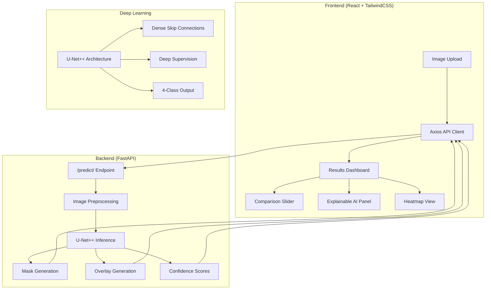

# 🧠 NeuroScan AI — Fetal Brain Segmentation Platform

> AI-powered medical imaging platform for real-time fetal brain segmentation from ultrasound images, featuring U-Net++ deep learning and an interactive clinical dashboard.


---

## 🏗️ Architecture



## ✨ Features

### Deep Learning
- **U-Net++** (Nested U-Net) with dense skip connections and deep supervision
- **Multi-class segmentation**: Brain, CSP (Cavum Septum Pellucidum), Lateral Ventricles
- **Hybrid loss**: Dice Loss + Cross Entropy for optimal training
- **MPS/CUDA/CPU** auto-detection for GPU acceleration

### Backend
- FastAPI with automatic API documentation
- Base64 encoded results (mask, overlay, heatmap)
- Per-class confidence scores
- Request timing and structured logging
- CORS enabled for frontend integration
- Docker-ready deployment

### Frontend
- Premium dark-mode SaaS dashboard design
- Drag-and-drop image upload with preview
- Real-time loading animations
- Before/after comparison slider
- Overlay transparency control
- Explainable AI insights panel
- Confidence heatmap visualization
- Download results functionality
- Analysis history
- Responsive mobile-first design

---

## 🚀 Quick Start

### Prerequisites
- Python 3.10+
- Node.js 18+
- PyTorch 2.0+

### 1. Install Backend Dependencies

```bash
cd backend
pip install -r requirements.txt
```

### 2. Prepare Dataset

```bash
python backend/prepare_dataset.py
```

This will:
- Extract ZIP archives
- Match image-mask pairs (584 pairs)
- Resize to 256×256, convert to grayscale
- Create 80/20 train/val split

### 3. Train Model

```bash
python backend/train.py --epochs 50 --batch-size 8 --lr 0.001
```

Training supports:
- `--patience N` — Early stopping patience (default: 10)
- `--batch-size N` — Batch size (default: 8)
- `--lr FLOAT` — Learning rate (default: 0.001)

Model saved to `backend/saved_models/model.pth`

### 4. Evaluate Model

```bash
python backend/evaluate.py
```

### 5. Start Backend

```bash
cd backend
uvicorn app:app --host 0.0.0.0 --port 8000
```

API docs available at: http://localhost:8000/docs

### 6. Start Frontend

```bash
cd frontend
npm install
npm run dev
```

Open http://localhost:5173 in your browser.

---

## 📊 Model Details

### Architecture: U-Net++

| Component | Details |
|-----------|---------|
| Encoder | 5-level pyramid [32, 64, 128, 256, 512] |
| Decoder | Dense nested skip connections |
| Supervision | Deep supervision (4 output levels) |
| Input | 256×256 grayscale |
| Output | 4-class probability maps |
| Parameters | ~9.16M |

### Classes

| Class | Color | Description |
|-------|-------|-------------|
| Background | Black | Non-brain regions |
| Brain | 🔴 Red | Fetal brain parenchyma |
| CSP | 🟢 Green | Cavum Septum Pellucidum |
| LV | 🔵 Blue | Lateral Ventricles |

### Loss Function

**Hybrid Loss** = 0.5 × Dice Loss + 0.5 × Cross Entropy Loss

---

## 📁 Project Structure

```
fetal-brain-segmentation/
├── backend/
│   ├── app.py                 # FastAPI application
│   ├── model.py               # U-Net++ architecture
│   ├── train.py               # Training pipeline
│   ├── evaluate.py            # Evaluation metrics
│   ├── inference.py           # Inference pipeline
│   ├── losses.py              # Hybrid loss functions
│   ├── dataset.py             # PyTorch Dataset + augmentation
│   ├── prepare_dataset.py     # Dataset preparation pipeline
│   ├── requirements.txt       # Python dependencies
│   ├── Dockerfile             # Backend Docker config
│   ├── saved_models/          # Trained model checkpoints
│   └── training_logs/         # Training metrics & plots
├── frontend/
│   ├── src/
│   │   ├── App.jsx            # Main application
│   │   ├── components/
│   │   │   ├── Header.jsx
│   │   │   ├── ImageUpload.jsx
│   │   │   ├── ResultsPanel.jsx
│   │   │   ├── ComparisonSlider.jsx
│   │   │   └── ExplainableAI.jsx
│   │   └── services/
│   │       └── api.js         # Axios API service
│   ├── Dockerfile             # Frontend Docker config
│   └── nginx.conf             # Nginx configuration
├── dataset/
│   ├── images/                # Preprocessed images
│   ├── masks/                 # Segmentation masks
│   └── split.npz              # Train/val split
├── docker-compose.yml
└── README.md
```

---

## 🐳 Docker Deployment

```bash
# Build and start all services
docker-compose up --build -d

# Backend: http://localhost:8000
# Frontend: http://localhost:3000
```

---

## 📄 API Documentation

### POST `/predict/`
Upload an ultrasound image for segmentation.

**Request:** `multipart/form-data` with `file` field

**Response:**
```json
{
  "success": true,
  "mask": "<base64 PNG>",
  "overlay": "<base64 PNG>",
  "heatmap": "<base64 PNG>",
  "confidence": 0.87,
  "class_scores": {
    "Background": 0.95,
    "Brain": 0.89,
    "CSP": 0.76,
    "LV": 0.82
  },
  "detected_structures": ["Brain", "CSP", "LV"],
  "inference_time_ms": 45.2
}
```

### GET `/health`
Health check endpoint.

### GET `/model-info`
Returns model architecture and training metadata.

---

## 📜 License

MIT License — for research and educational purposes only.

> ⚠️ **Disclaimer**: This is an AI research tool, not a medical device. It is not FDA-approved
> and should not be used for clinical diagnosis. Always consult qualified medical professionals.
# fetal_brain_segmentation_v1
